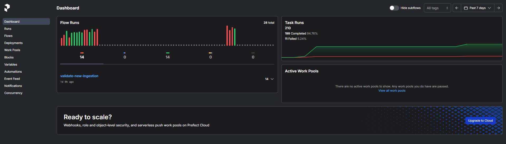
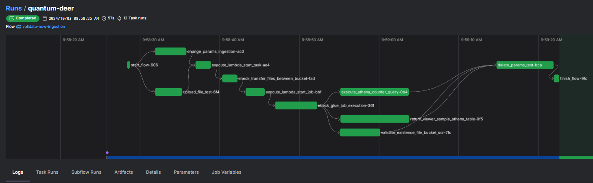
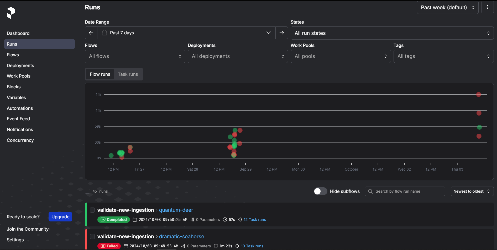
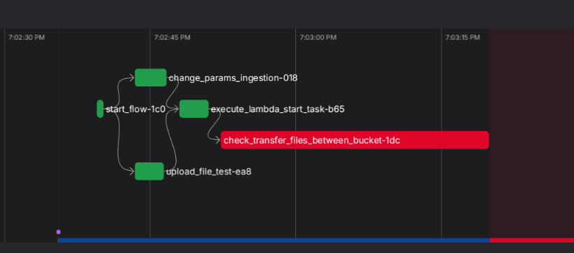
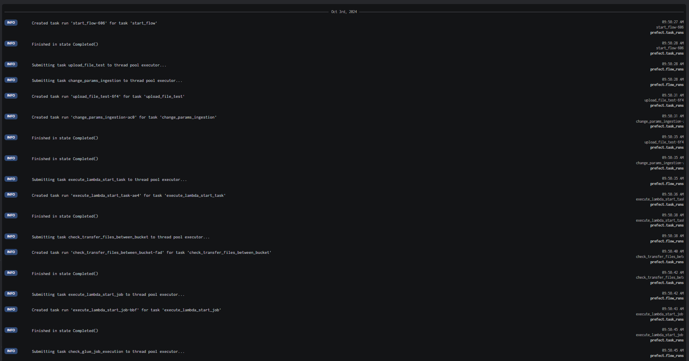

# prefect-automation-test-poc
Este repositório apresenta uma solução para automação de testes de pipelines de ingestão de dados.

## Briefing

Entre as responsabilidades de um engenheiro de dados, destaca-se a capacidade de automatizar processos que proporcionem ganhos de tempo, permitindo a alocação de esforços em otimizações de pipelines e/ou no desenvolvimento de novas soluções para a plataforma sob sua gestão.

Recentemente, surgiu a necessidade de automatizar o processo de teste de ingestão de novas bases para a camada SOR no domínio de dados Mesh, sob nossa responsabilidade, garantindo a geração de evidências para nosso controle. Esse processo deveria ser realizado interagindo com a AWS Cloud.

Já possuíamos um script que acompanhava o andamento do pipeline, desde o upload de arquivos em um bucket S3 até a realização de consultas na respectiva tabela no Athena. No entanto, a principal dificuldade era a ausência de uma interface gráfica que nos mostrasse todas as etapas envolvidas no teste. Precisávamos de uma ferramenta com uma UI amigável e que gerasse logs detalhados dessas etapas, até que encontramos o [Prefect](https://www.prefect.io/).

Segundo a própria definição da plataforma, o "Prefect oferece ferramentas modernas de orquestração de workflows para construir, observar e reagir de maneira eficiente a pipelines de dados."



Entre os principais benefícios de utilizar uma ferramenta como o Prefect, estão:
- Facilidade na automação.
- Gestão de dependências.
- Interface de monitoramento intuitiva.
- Orquestração condicional.
- Agendamento de processos.
- Suporte a eventos (_Event-Driven_).
- Execuções assíncronas.
- **Execução em ambiente Windows**.



Este último benefício, em particular, foi o que mais me chamou a atenção. Explico:

Durante o processo de descoberta (_discovery_), inicialmente considerei utilizar o Airflow, que é atualmente uma das ferramentas de orquestração de pipelines mais populares no mercado de engenharia de dados, sendo amplamente utilizado por grandes empresas de diversos setores. No entanto, para a automação que desejávamos, precisávamos de uma solução que permitisse a execução do processo de forma simples, sem a necessidade de configurar ambientes locais com Docker ou outros componentes que poderiam gerar complexidade adicional, como licenciamento e configurações avançadas. Por isso, optei por seguir com o Prefect para esta POC, devido à facilidade que a ferramenta oferece.

## Getting Started

A instalação do Prefect é simples. Primeiramente, crie um ambiente virtual do Python e, em seguida, execute o seguinte comando:

```bash
pip install prefect~=3.0.2
```

Assim que o Prefect estiver instalado, execute o script **setenv.bat** para configurar as variáveis locais do Prefect: _profile_ e _url_.

**Observação:** Após a primeira execução do Prefect, um banco de dados local será criado automaticamente. Geralmente, ele será armazenado na raiz do diretório do usuário, com a nomenclatura _.prefect_.

Em seguida, já é possível iniciar o servidor local diretamente no terminal:

```bash
prefect server start
```

## Conceitos Básicos

Existem dois conceitos principais que precisamos entender para trabalhar com o Prefect: **Task** e **Flow**.

- **Task** é a unidade de trabalho no Prefect. Ela encapsula uma função ou operação específica que você deseja executar. Pode ser uma função simples ou uma ação mais complexa, como mover arquivos entre sistemas.

    ```python
    from prefect import task

    @task(name="_task_say_hello")
    def say_hello():
        print("Hello, Prefect!")
    ```

- **Flow** é o núcleo de um pipeline no Prefect. Ele representa um conjunto de tarefas organizadas em uma sequência ou estrutura. Um flow define como as tarefas se relacionam e a ordem de execução.

    ```python
    from prefect import flow

    @flow(name="First Flow")
    def my_flow():
        print("Executando o fluxo")
    ```

## Visão Geral da UI

Conforme mencionado, o Prefect possui uma interface extremamente amigável. No menu lateral, há diversas opções que auxiliam nas atividades do dia a dia.

Um dos principais menus é o de _Runs_, onde é possível visualizar todas as execuções realizadas no ambiente local.



No menu _Flow_, conseguimos verificar o status de cada execução, assim como o resultado das tarefas — se foram concluídas com sucesso ou se ocorreram falhas.



Também é possível visualizar os logs detalhados durante o processo, facilitando a validação do fluxo e a identificação de possíveis problemas.



## Caso de Uso - POC

O script criado simula o pipeline de produção, com algumas diferenças, incluindo etapas adicionais para validar outros cenários de uso da ferramenta.

As tarefas (_tasks_) criadas executam os seguintes processos:
- Upload de arquivos em buckets S3 na AWS.
- Validação da existência de arquivos em buckets S3 na AWS.
- Invocação de funções Lambda.
- Alteração e exclusão de parâmetros no Parameter Store (AWS Systems Manager).
- Execução de consultas no Athena.

Ao final, o fluxo exibe evidências do sucesso de todas as tarefas.


